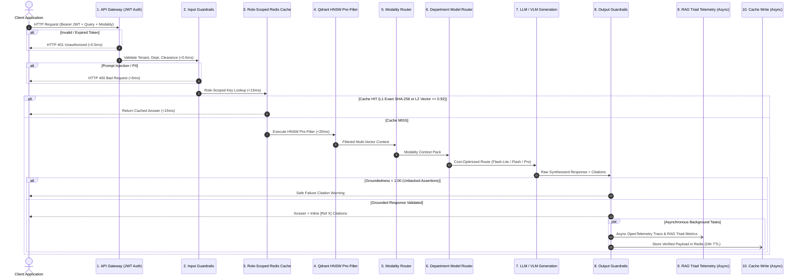

# A.X.I.O.M. — Adaptive eXtended Intelligence & Omnimodal Memory
### Enterprise Multi-Modal RAG & 2-Tier Cache Architecture Specification for C.O.R.E.

[](#)
[](#)
[](#)
[](#)
[](#)

---

## ⚡ 30-Second Executive Pitch
> **A.X.I.O.M.** is the sovereign Knowledge Intelligence Layer powering the **C.O.R.E. ecosystem** — a production-grade Enterprise RAG & Semantic Cache specification engineered to ingest and retrieve 4 heterogeneous data modalities (**Text, Image, Audio, Video**) with zero hallucinations, 2-checkpoint RBAC security, and sub-15ms cache response times. Every design decision is backed by mathematical formulations and system trade-offs — from why **ColPali MaxSim** eliminates Cross-Encoder rerankers for visual retrieval, to why **Qdrant HNSW Pre-Filtering** is mathematically mandatory to prevent cross-tenant vector leakage.

---

## 🌐 C.O.R.E. Ecosystem Architecture Connection

A.X.I.O.M. operates as the central memory and knowledge retrieval backbone across C.O.R.E.'s distributed nodes:

```text
                     ┌─────────────────────────────────────────┐
                     │         C.O.R.E. SOVEREIGN AI OS        │
                     └────────────────────┬────────────────────┘
                                          │
            ┌─────────────────────────────┼─────────────────────────────┐
            │                             │                             │
            ▼                             ▼                             ▼
   ┌─────────────────┐           ┌─────────────────┐           ┌─────────────────┐
   │      JAMES      │           │      DAVID      │           │    A.X.I.O.M.   │
   │  Flutter Mobile │           │  Desktop Python │           │ Omnimodal Memory│
   │   Client Node   │           │   Agent Node    │           │ [THIS RFC SPEC] │
   └─────────────────┘           └─────────────────┘           └────────┬────────┘
                                                                        │
                         ┌───────────────────┬───────────────────┬──────┴────────────┐
                         ▼                   ▼                   ▼                   ▼
                 ┌──────────────┐    ┌──────────────┐    ┌──────────────┐    ┌──────────────┐
                 │  Text Memory │    │ Visual Memory│    │ Voice Memory │    │ Video Memory │
                 │Docs, RFCs, DB│    │Diagrams, PDFs│    │Calls, Notes  │    │Keyframe Sync │
                 └──────────────┘    └──────────────┘    └──────────────┘    └──────────────┘
```

---

## 🔄 End-to-End Operational Sequence (11-Stage Pipeline)

Every user query passes through an 11-stage sequential pipeline with strict latency budgets and fail-safe boundaries:



---

## 🎯 4-Modality Engine Matrix

A.X.I.O.M. replaces brittle, text-only RAG pipelines with dedicated, modality-specific retrieval engines:

| Modality | Ingestion & Representation Engine | Retrieval Algorithm | Key Architectural Differentiator |
| :--- | :--- | :--- | :--- |
| **Text** | **Parent-Child Chunking** (1000t / 200t) + **Matryoshka 1536d $\to$ 128d** slicing | **BM25 + HNSW Hybrid RRF** $\to$ Cross-Encoder (`bge-reranker-large`) | 91.7% RAM reduction; Cosine similarity converts to CPU SIMD Dot Product via L2 standardization. |
| **Image** | **ColPali ViT Patches** ($32 \times 32$ grid = 1,024 patch vectors per page) | **MaxSim Late Interaction** $\text{Score} = \sum_{q} \max_{p} (v_q \cdot v_p)$ | **Zero OCR / Zero text parsing.** Tables, charts, and spatial layouts are natively preserved. Eliminates reranker latency. |
| **Audio** | **Dual-Path Pipeline**: WhisperX word timestamps + CLAP acoustic fingerprinting | **Multi-Vector Qdrant Search** (`speech_vec` + `acoustic_vec`) | Voice Activity Detection (VAD) chunking (10s–45s) prevents mid-word truncation; matches non-verbal sounds. |
| **Video** | **3-Stream Pipeline**: PySceneDetect visual keyframes + WhisperX speech + CLAP sound | **3-Stream Temporal RRF Search** with synchronized millisecond offsets | Deep-links directly to video playback coordinates (`timestamp_start_ms`), enabling second-level navigation. |

---

## ⚡ 2-Tier Multi-Modal Cache Architecture

```text
Incoming Query
     │
     ├──► Tier 0: Exact Hash Lookup (< 1ms)
     │    Text: SHA-256 Hash  ·  Image: pHash (Hamming <= 4)  ·  Audio: Chromaprint
     │    └──► HIT: Return Instant Response
     │
     └──► Tier 1: Semantic Vector Cache (~15ms)
          Slices 128d Matryoshka vector in Redis RAM (Cosine Similarity >= 0.92)
          └──► HIT: Return Instant Response (Bypasses Qdrant & LLM!)
          └──► MISS: Pass pre-computed 1536d vector to Qdrant (Zero re-embedding overhead)
```

### Cryptographic Role-Scoped Cache Keys
$$\text{Key} = \text{SHA256}\Big( \text{TenantID} \parallel \text{DeptID} \parallel \text{ClearanceLevel} \parallel \text{NormalizedQuery} \Big)$$
* Cryptographically guarantees that executive answers are never leaked to unprivileged employees on identical search strings.

---

## 🛡️ 2-Checkpoint Enterprise Zero-Trust Security

1. **Checkpoint 1 (API Gateway Auth, $<0.5\text{ms}$):** Cryptographically verifies RS256 JWT signatures, checks expiration, and extracts `tenant_id`, `department_id`, and `clearance_level` (0 to 3). Unauthorized requests drop immediately.
2. **Checkpoint 2 (Qdrant HNSW Pre-Filtering, $<20\text{ms}$):** Evaluates payload security bitmasks **before** graph traversal:
   $$\text{Filter: } \text{tenant} == \text{user\_tenant} \land \text{dept} == \text{user\_dept} \land \text{clearance} \le \text{user\_clearance} \land \text{is\_active} == \text{true}$$
   * **Why Pre-Filtering vs. Post-Filtering:** Post-filtering causes **Candidate Starvation** (dropping unauthorized vectors after Top-$K$ retrieval leaves the user with 0 candidates) and **Side-Channel Leakage**. Pre-filtering guarantees a full set of $K$ authorized chunks with zero cross-tenant vector exposure.

---

## 📊 Hard Performance SLA & Cost Economics

### Latency Budget
| Pipeline Segment | Target SLA | Hard Ceiling | Optimization Strategy |
| :--- | :---: | :---: | :--- |
| **JWT Gateway Verification** | `< 0.5ms` | `1.0ms` | Stateless public-key RS256 caching |
| **Cache Hit (L1/L2)** | `< 15.0ms` | `30.0ms` | In-memory Redis Stack HNSW / SIMD Dot Product |
| **Qdrant RBAC Pre-Filter** | `< 20.0ms` | `50.0ms` | Payload bitmask indexing in Rust engine |
| **Full Text RAG Retrieval** | `< 200.0ms` | `400.0ms` | 128d Matryoshka coarse search + Cross-Encoder rerank |
| **Visual ColPali Retrieval** | `< 400.0ms` | `800.0ms` | SIMD MaxSim dot product over 1,024 patch vectors |
| **End-to-End Response (Flash)** | `< 600.0ms` | `1200.0ms` | Gemini 2.5 Flash streaming inference |

### Department Model Routing Cost Economics
Instead of routing all enterprise traffic through costly frontier models ($20/M tokens), A.X.I.O.M. routes queries dynamically by department clearance:
* **HR & Support ($60\%$ volume):** Gemini 2.5 Flash-Lite ($0.10/M tokens, $<300\text{ms}$).
* **Engineering ($30\%$ volume):** Gemini 2.5 Flash ($1.00/M tokens, $<800\text{ms}$).
* **Legal & Finance ($10\%$ volume):** Gemini 2.5 Pro ($20.00/M tokens, complex legal reasoning).

$$\text{Net Enterprise API Cost Savings} = \mathbf{88.6\% \text{ Reduction vs. Monolithic Frontier Baseline}}$$

---

## 📚 Complete Technical Specification Index

Deep-dive architectural RFCs with complete schemas, mathematical derivations, and state machine diagrams are documented in [`/docs`](./docs):

| Chapter | Module Title | Primary Focus & Deliverables |
| :---: | :--- | :--- |
| [**`00`**](./docs/00_operational_flow.md) | **Operational Flow** | 11-stage sequential pipeline, latency budgets, and safe failure decision gates. |
| [**`01`**](./docs/01_cache_architecture.md) | **Cache Architecture** | 2-Tier Multi-Modal Semantic Cache (SHA-256 + Matryoshka 128d) and Role-Scoped Keys. |
| [**`02`**](./docs/02_matryoshka_rag_engine.md) | **Matryoshka RAG Engine** | MRL 1536d $\to$ 128d slicing, L2 standardization, HyDE, and Hybrid RRF BM25+HNSW search. |
| [**`03`**](./docs/03_multimodal_rag.md) | **Omnimodal Engine** | ColPali MaxSim visual retrieval, WhisperX audio alignment, and 3-stream video search. |
| [**`04`**](./docs/04_enterprise_security.md) | **Enterprise Security** | 2-Checkpoint RBAC, 4-tier clearance levels, and Qdrant HNSW pre-filtering proof. |
| [**`05`**](./docs/05_ingestion_etl.md) | **Ingestion ETL & Purge** | Async CQRS write pipeline, 3-state soft-delete versioning, and department retention rules. |
| [**`06`**](./docs/06_observability.md) | **Observability & Telemetry**| RAG Triad scoring (1.00 Groundedness SLA), OpenTelemetry spans, and citation mapping. |
| [**`07`**](./docs/07_circuit_breakers_sla.md) | **Circuit Breakers & SLAs** | 6-key round-robin rotation, 3-state circuit breaker machine, and department cost routing. |

---

## 🖥️ Local Visual Specifications
For rich visual browser rendering with interactive dark-mode CSS styling, open the visual blueprints located in [`/visual_specs`](./visual_specs):
* `visual_specs/00_operational_flow.html`
* `visual_specs/01_cache_architecture.html`
* `visual_specs/02_matryoshka_rag_engine.html`
* `visual_specs/03_multimodal_rag.html`
* `visual_specs/04_enterprise_security.html`
* `visual_specs/05_ingestion_etl.html`
* `visual_specs/06_observability.html`
* `visual_specs/07_circuit_breakers_sla.html`
* `visual_specs/visual_architecture.html`

---

## ⚖️ Architectural Status & Intellectual Property Notice
A.X.I.O.M. is authored as an **Enterprise System Architecture Specification and Request for Comments (RFC)** for the C.O.R.E. ecosystem. It defines mathematical bounds, distributed state machines, and latency budgets prior to hardware provisioning and distributed infrastructure deployment.
