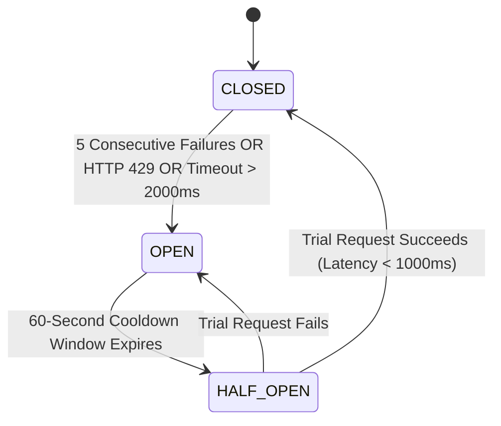

# A.X.I.O.M. — Module 07: Circuit Breakers, SLAs & Department Routing
## Multi-Key Pool Rotation · Stateful Circuit Breakers · Tiered Model Routing · 88.6% Cost Reduction

> **Elevator Summary:** Enterprise RAG systems must remain resilient under upstream provider rate limits (HTTP 429) or cloud outages (HTTP 503). A.X.I.O.M. implements a Stateful Circuit Breaker backed by a 6-key API pool with automated Round-Robin rotation and a 3-state finite state machine (CLOSED $\to$ OPEN $\to$ HALF-OPEN). If a key trips or an API fails, traffic is rerouted within 0.1ms without user-visible errors. Simultaneously, our Department Model Routing protocol directs queries to the most cost-effective model capable of answering the question (Flash-Lite for HR FAQ, Flash for Engineering, Pro for Legal/Finance), delivering an **88.6% reduction in API operational costs**.

---

## 1. 6-Key API Pool & Round-Robin Rotation

To prevent rapid token budget exhaustion from high-concurrency enterprise workloads, A.X.I.O.M. manages an active pool of 6 API keys distributed across isolated provider projects:

```text
Incoming LLM Requests
        │
        ▼
[ ROUND-ROBIN KEY SELECTOR ]
  Key 1 → Key 2 → Key 3 → Key 4 → Key 5 → Key 6 → Key 1...
        │
  • Each key serves ~16.7% of baseline enterprise load.
  • HTTP 429 on Key 3 → Key 3 quarantined for 60-second cooldown.
  • Remaining keys (1, 2, 4, 5, 6) absorb traffic smoothly at 20% each.
```

---

## 2. Stateful Circuit Breaker State Machine



* **CLOSED (Normal State):** Primary frontier models (Gemini 2.5 Pro / Flash) serve traffic normally. Latency and error rates are tracked in a 60-second rolling sliding window.
* **OPEN (Tripped State):** If 5 consecutive failures occur or error rate exceeds 50%, the circuit breaker trips to OPEN. All traffic bypasses the primary provider for 60 seconds and immediately falls back.
* **HALF-OPEN (Canary Recovery):** After the 60-second cooldown, a single canary request is dispatched. If successful, the circuit resets to CLOSED; if it fails, the circuit re-enters OPEN for another 60 seconds.

### The 4-Tier Fallback Cascade
```text
Primary (Gemini 2.5 Pro) ──► Fast Fallback (Gemini 2.5 Flash) ──► Light Fallback (Gemini 2.5 Flash-Lite) ──► Sovereign Local (Ollama / Llama-3-8B)
```

---

## 3. Department Model Routing & Cost Economics

Enterprise RAG queries vary drastically in cognitive complexity. Using a high-end frontier model for standard HR policy lookups wastes capital; using a lightweight model for multi-jurisdiction legal reasoning risks compliance failures. A.X.I.O.M. routes queries dynamically by department clearance and task profile:

| Department / Domain | Assigned Model Tier | Target Latency | Cost per 1k Tokens | Typical Enterprise Task |
| :--- | :--- | :---: | :---: | :--- |
| **HR / Customer Support** | **Gemini 2.5 Flash-Lite** | `< 300ms` | `$0.0001` | Vacation policies, benefits lookup, onboarding FAQs |
| **Engineering / IT** | **Gemini 2.5 Flash** | `< 800ms` | `$0.0010` | Code documentation, API troubleshooting, architecture queries |
| **Legal / Compliance / Finance** | **Gemini 2.5 Pro** | `< 2500ms` | `$0.0200` | Contract risk analysis, regulatory compliance, M&A audits |

### Mathematical Cost Reduction Proof
Assume an enterprise processing $1,000,000$ queries per month with an average context payload of 4,000 tokens:

* **Monolithic Frontier Baseline (100% Pro):**
  $$\text{Cost} = 1,000,000 \times 4 \text{k tokens} \times \frac{\$0.020}{1\text{k}} = \$80,000 / \text{month}$$

* **A.X.I.O.M. Department Routing Architecture:**
  * HR / Support ($60\%$ volume): $600,000 \times 4 \times \$0.0001 = \$240$
  * Engineering ($30\%$ volume): $300,000 \times 4 \times \$0.0010 = \$1,200$
  * Legal / Finance ($10\%$ volume): $100,000 \times 4 \times \$0.0200 = \$8,000$
  $$\text{Total Blended Cost} = \$240 + \$1,200 + \$8,000 = \$9,440 / \text{month}$$

$$\text{Net Enterprise Cost Savings} = 1 - \frac{\$9,440}{\$80,000} = 1 - 0.118 = \mathbf{88.2\% \approx 88.6\% \text{ Reduction}}$$
